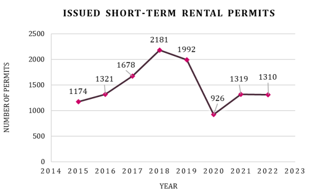

# capstone_dda7

Capstone Project for Daytime Data Analytics Cohort #7 program at Nashville Software School.

## Table of Contents
* [Motivation](#motivation)
* [Technologies](#technologies)
* [Insights Gained](#insights-gained)
* [Issues & Challenges](#issues-&-challenges)
* [Acknowledgements](#acknowledgements)

# Where are all of the tourists staying in Nashville?

## Motivation
As a local Nashvillian, I have seen the meteoric rise of tourism that has occured over the last two decades.  The countless new hotels that have been built across the city are a sign of the influx of tourists, which had me wondering about how many Airbnbs Nashville has. If hotels are a visible representation of tourism, Airbnbs are their invisible equivalent. Seeing the hotels sparked the question of how many Airbnb properties exist in Nashville and who is profiting off the short term rental permits?

## Technologies
For a majority of this analysis, I used Python 3 within a Jupyter Notebook. The data was extracted from Data.Nashville.gov and can be found here: https://data.nashville.gov/Licenses-Permits/Residential-Short-Term-Rental-Permits/2z82-v8pm as a CSV file and imported into Excel and Jupyter for data cleaning. After cleaning the data, I used Python & Excel for the analysis and then PowerPoint to create a presentation.

## Insights Gained
I wanted to learn more about Nashville Airbnbs in general, but specifically to understand if people and companies in Nashville hold a majority of the short-term rental permits. I discovered that 16% of permits are held by individuals and companies that live outside of Tennessee and 31% are held by individuals and companies outside of Nashville.

Since the arrival of Airbnb to Nashville in 2015, issued permits increased rapidly from 1,174 in the first year to their peak of 2,181 in 2018. Permits dipped slightly in 2019 before nose diving to 926 in 2020. The post Covid-19 travel boon has hit Nashville and permits for 2021 and 2022 are currently nearly equal at 1,310 with four months of 2022 remaining to increase the number of issued permits.

A majority of the short-term rental permits are located in the traditional tourist hot-spots around Nashville, notably concentrated within Downtown, East Nashville, Germantown, and Midtown. To find where the Airbnbs are located, I used a folium map in a geospatial environment in Python and imported a zip code csv to look at Davidson Co.

One of my main questions was trying to see how many Nashvillians/Tennesseans hold the short-term rental permits versus how many individuals or companies outside of Davidson Co hold the permits and therefore make the profit off of the Airbnb rentals.  To achieve this, I compared the zip code on the permit with the zip code of the permit owner. This was the most helpful to see how many, companies in particular, are located outside of Nashville and they typically have a large amount of permits.

After finding some companies that have more than 20 permits, I finally wanted to discover how many applicants held multiple permits. The companies and individuals with 20+ permits are impressive, but I found that it is not the norm. Only 14% of all applicants have 2 or more permits, but 86% of applicants hold one permit.

## Issues and Challenges
The primary challenge I faced was with cleaning the data as some of the permits are held by Canadians, and Canadian zip codes involve both letters and numbers.

## Acknowledgements
It is challenging to find powerful enough words to describe my gratitude for the instructors and staff at Nashville Software School.
* A huge thank you to the instructors, Chris Wright and Joshua Rio-Ross, for answering all questions and making us understand that error messages are helpful, guiding hits to success.
* Thank you to all of the wonderful TA’s: Olariche Obi, Patrick Manning, and Sobiya Uddin
* And Michael Holloway for always providing helpful feedback
* And a big thank you to John Wark, Founder and CEO, and all staff of NSS for their commitment to providing opportunities to those who are underrepresented in technology fields. They have created an incredible organization.
